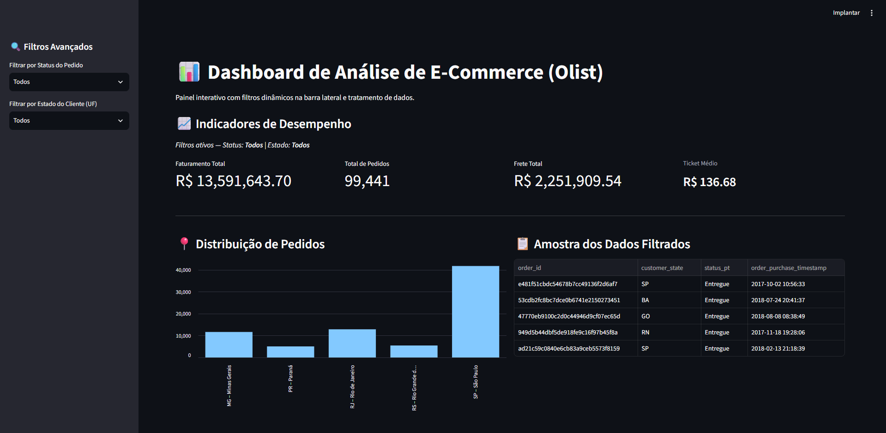
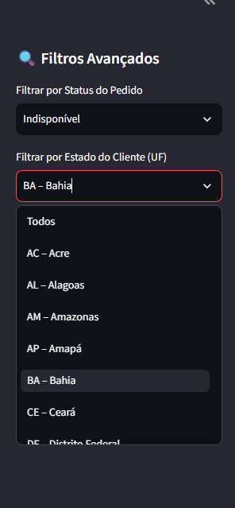

# 📊 Dashboard de Análise de E-Commerce (Olist)

Painel interativo e analítico desenvolvido em **Python** utilizando **Streamlit** e **Pandas**, criado para explorar os dados públicos de vendas da **Olist**. O projeto centraliza indicadores de desempenho (KPIs), comportamento de pedidos e distribuição geográfica em uma interface web dinâmica.

[](https://fabio-anselmo-dashboard-olist.streamlit.app/)

---

## 📸 Pré-visualização do Dashboard

> *Visão geral da interface principal com os Indicadores de Desempenho (KPIs) e filtros dinâmicos ativos.*
> 

> *Detalhe da barra lateral (Sidebar) com filtros de Status e Estados do Brasil devidamente normalizados.*
> 

---

## 🚀 Funcionalidades e Arquitetura
* **Processamento de Dados com Pandas:** Cruzamento eficiente entre as bases de pedidos, itens e clientes, com otimização de memória através de seleção de colunas (`usecols`) e tratamento de cache (`@st.cache_data`).
* **Tratamento de Anomalias:** Normalização de strings para maiúsculas, remoção de espaços em branco e mapeamento de inconsistências na base original (como dados corrompidos na UF do Amazonas).
* **Blindagem de Interface:** Injeção controlada de script via Streamlit para impedir traduções automáticas indesejadas do navegador em métricas críticas (ex: *Ticket Médio* e siglas de estados).

---

## 📈 Resultados e Análise de Indicadores

O painel foi estruturado para responder a perguntas estratégicas de negócio do e-commerce através de quatro métricas principais:

1. **Faturamento Total:** Soma de todos os valores monetários (`price`) dos produtos vendidos nos pedidos filtrados. Permite avaliar o volume bruto de vendas por estado ou status.
2. **Total de Pedidos:** Contagem distinta (`nunique`) de ordens de compra (`order_id`), refletindo o volume de transações concluídas.
3. **Frete Total:** Soma acumulada dos custos de frete cobrados, essencial para entender o impacto logístico nas operações.
4. **Ticket Médio:** Calculado pela divisão direta entre o *Faturamento Total* e o *Total de Pedidos*. Representa o valor médio gasto por compra no e-commerce, servindo como termômetro para estratégias de *cross-selling* e *upselling*.

---

## 🛠️ Tecnologias Utilizadas
* **Python** (Linguagem de Programação)
* **Streamlit** (Framework para aplicações web de dados)
* **Pandas** (Biblioteca para manipulação e análise de dados tabulares)
* **Git & GitHub** (Controle de versão e hospedagem de código)

---

## 📂 Estrutura do Repositório
```text
├── archive/                  # Datasets originais da Olist (CSV)
├── assets/                   # Imagens e prints utilizados na documentação
├── app.py                    # Código-fonte principal da aplicação
├── .gitignore                # Arquivos ignorados pelo Git
└── README.md                 # Documentação oficial do projeto